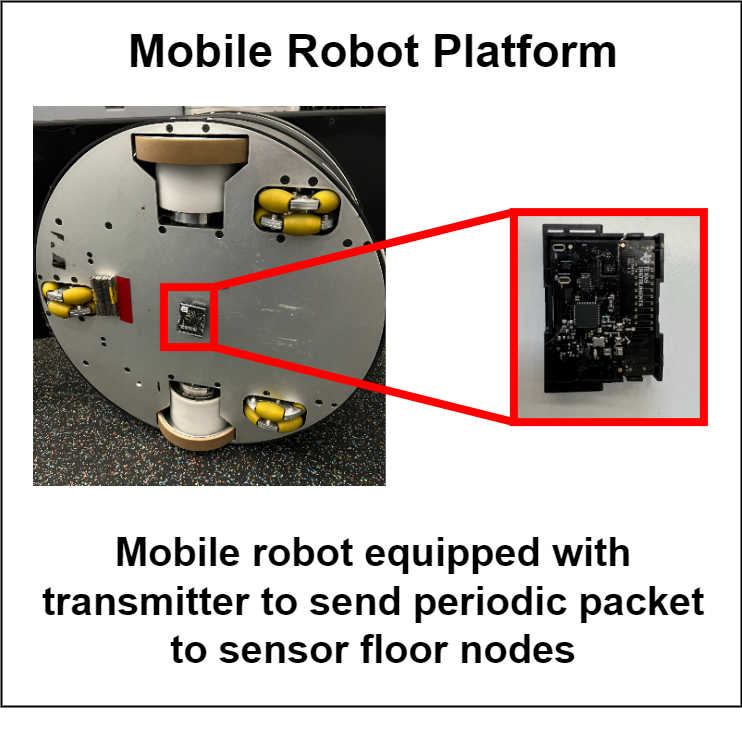

# Sensor Floor
[](https://flw.mb.tu-dortmund.de/wordpress/wp-content/uploads/2018/06/Boden.mp4)
Video of sensor floor architecture at FLW research hall

* Management software for PhyNetLab: sensor floor

* To install one wire library:
```
sudo apt-get install git python-pip owfs python-ow ow-shell
```

#### Localization application using sensor floor ####

The data set for the localization task can be found on <https://www.kaggle.com/c/summerschool2020/overview>. The mobile robot is equipped with transmitter and transmits periodic packet to all sensor floor nodes.

Mobile Robot Platofrm
```

```

Sensor Floor Workflow
```

```


